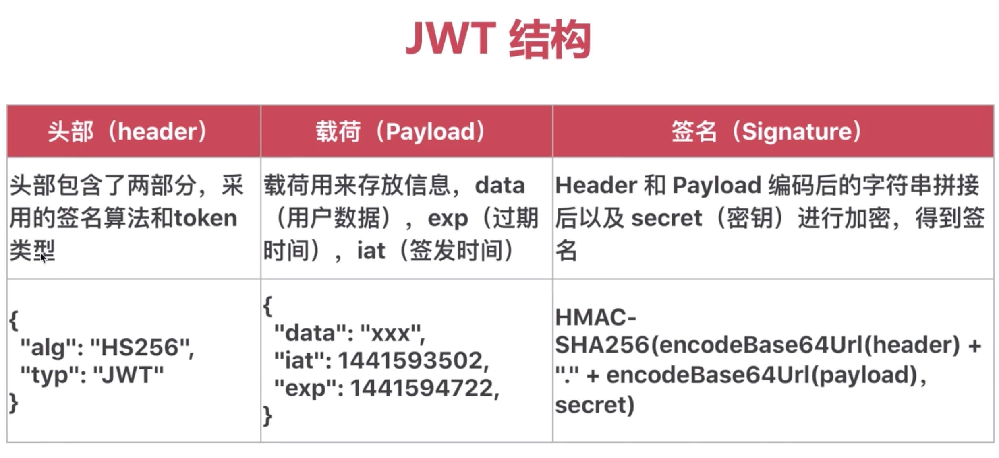
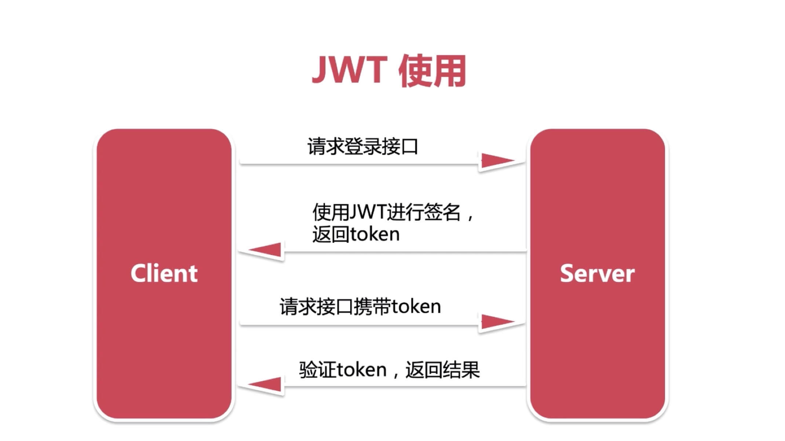

<h3>1. Egg.js中的渐进式开发</h3>

通用组件 -》 框架扩展 -》 内置插件 -》 独立插件 -》 抽象框架 <br/>
这个逐渐独立、完善的过程称为渐进式开发。<br/>

需求：在各个页面获取本机设备信息<br/>

各种做法：<br/>
通用组件：在app/utils下封装一个获取本机信息的通用方法。 <br/>
框架扩展：在app下新增extend文件夹，新增context.js文件，将 获取本机器的info()方法封装到里面<br/>
内置插件：在根目录下创建lib/plugin/egg-info/app/extend; egg的内置插件用egg开头 ，将 获取本机器的info()方法封装到extend的context.js文件下。<br/>
并导出package.json（ ⚠️注意：插件需要导出）。并在config/plugin.js中倒导入该插件。path: path.join(__dirname, '../lib/plugin/egg-info') 生成该插件的相对路径。

<h3>2. Controller、 Service 和 test 单元测试</h3>

（M）Service：就是在复杂业务场景下用于做业务逻辑封装的一个抽象层<br/>
（V）View：视图模版展示<br/>
（C）Controller：负责处理业务逻辑；比如根据用户访问不同的 URL，渲染不同的模板得到 HTML 返回给用户<br/>

<h3>3. mysql数据库常用命令</h3>

-- 查看数据库<br>
show databases;

-- 删除数据库 <br>
drop database egg;

-- 创建数据库<br>
create database egg;

-- 查看当前使用的数据库<br>
select database();

-- 在数据库中创建表<br>
use egg;<br>

```

create table user(
  id int(10) not null auto_increment, 
  name varchar(20) not null default 'admin' comment '用户名',
  pwd varchar(50) not null comment '密码',
  primary key(id)
)engine=InnoDB charset=utf8;

```

create table gannt(
  id CHAR(36) PRIMARY KEY COMMENT '编号' DEFAULT 1,
  label varchar(50) not null comment '需求名称',
  user varchar(10) not null comment '用户名',
  start DATETIME not null comment '开始时间',
  endDate DATETIME not null comment '结束时间',
  duration int(50) not null comment '周期',
  percent int(10) not null default 0 comment '完成度',
  type varchar(10) not null comment '类型',
  proType varchar(10) not null comment '产品需求',
  risk varchar(10) not null comment '风险预警xxx',
  parentId int(100) not null comment '父ID',
  childId varchar(100) not null comment '子ID'
)engine=InnoDB charset=utf8;

tips: <br>
int、varchar 前者为基本数据类型、后者为string类型<br>
auto_increment 自动递增<br>
default 'admin' 默认名称<br>
primary key(id) 以id为主键<br>
engine=InnoDB 存储引擎 （ InnoDB 的设计目标是处理大容量数据时最大化性能，它的 CPU 利用率是其他所有基于磁盘的关系数据库引擎中最有效率的。）<br>


-- 查看表<br>
show tables;<br>

-- 查看表结构<br>
desc user;<br>

-- 删除表<br>
drop table user;<br>

-- 重命名表 <br>
rename table egg to egg1;

-- 插入表数据<br>
insert into user(name, pwd) values('user1', '123');<br>
insert into user values(2, 'user2', '123');<br>
insert into user values(3, 'user3', '123');<br>

tips: <br>
可以指定字段顺序，否则按照表结构中的字段顺序执行<br>

-- 查询表数据<br>
select * from user;<br>
select id,name from user;            // 查询指定字段<br>
select id,name from user where id=1; // 数据筛选<br>

-- 修改表数据<br>
update user set pwd='123456' where id = 1;<br>

-- 删除表数据<br>
delete from user where id = 2;<br>

-- 更新字段内容<br>
update 表名 set 字段名 = replace(字段名,’旧内容’,’新内容’)

默认更新全部符合条件的数据

<h3> 4. egg-sequelize的使用  </h3> 

-- 在sequelize中， 每个表都当作一个模型，表名称与模型名称保持一致。<br>

<h3>5. SQL命令补充</h3>

-- 表中列的数据类型的修改<br>
ALTER TABLE gannt CHANGE start start INT;<br>
ALTER TABLE gannt CHANGE duration duration INT;<br>

-- 表中列的数据的删除<br>
ALTER TABLE gannt  DROP start;<br>

-- 表中列的数据的增加<br>
ALTER TABLE gannt ADD start DATETIME;<br>

delete from gannt where id = 2;<br>


<h3>6. sequeliz文档补充</h3>

sequeliz数据库常用方法补充：https://github.com/demopark/sequelize-docs-Zh-CN/blob/master/core-concepts/model-querying-basics.md<br>

<h3>7. 如何启动SQL数据库</h3>

sudo /usr/local/mysql/bin/mysql -u root -p <br/>

<h3>8. 本地SQL数据库兼容问题</h3>
node版本与sql高版本不兼容，查看当前macOS的版本，使用对应的低版本的sql安装包。<br/>
如果报错用户没有权限时：mac连接mysql出现Access denied for user 'root'@'localhost' (using password: YES)<br/>
https://blog.csdn.net/zhangqiang180/article/details/104665987/<br/>

<h3> 9. JWT验权 </h3>

流程：前端 -》用户信息（加密）-》服务端 -》用户信息（解密）-》数据库 -》服务端（验证无误）-》前端 <br/> 





<h3>问题总结：</h3>

Q：sequelize的startsWith在数据库检索时，无法区分1_ 和 13_ ， 为什么会这样，怎么解决？<br/>

A： startsWith方法执行的是LIKE语句，该语句仅支持模糊查询；如果需要精确查询的话，可以使用<br/>
```
  [Op.regexp]: [`^${len[i].id}_`]
```

该方法执行的是：<br/>

```
Executed (default): SELECT `id`, `label`, `user`, `start`, `endDate`, `duration`, `percent`, `type`, `proType`, `risk`, `parentId`, `childId` FROM `gannt` AS `gannt` WHERE `gannt`.`childId` REGEXP '^1_';
```


